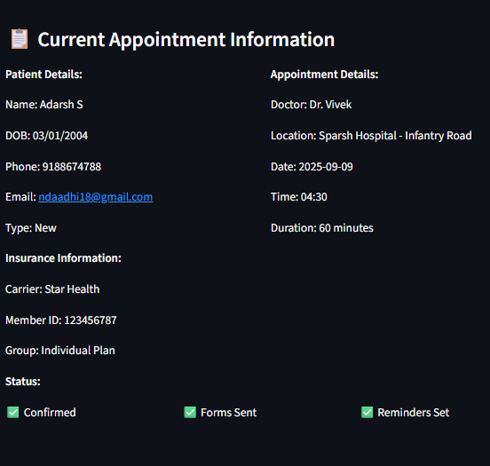

# 🥠Medical Appointment Scheduling AI

An intelligent appointment booking system that automates patient scheduling, reduces no-shows, and streamlines clinic operations using LangGraph multi-agent orchestration and Google Gemini AI.

---

## 📸 Result Screenshots / Videos

Below are screenshots and demo videos showcasing the working application:

### Screenshots

- **Home Screen & Chatbot Interface**
  

- **Appointment Confirmation**
  

- **Excel Export Example**
  

- **Email Confirmation Example**
  

- **Form issued to Patient Email**
  


## 🯠Project Overview

This AI-powered medical appointment scheduling system provides a complete solution for healthcare facilities to automate their booking process. Built using cutting-edge AI technologies, it handles the entire patient journey from initial contact to appointment confirmation and follow-up reminders.

### 🚀 Key Features

- **Multi-Agent Architecture**: 6 specialized AI agents handle different booking stages
- **Smart Patient Detection**: Automatically identifies new vs returning patients based on comprehensive patient records.
- **Intelligent Scheduling**: Determines 60-minute slots for new patients and 30-minute for returning patients, and provides a Calendly link for booking.
- **Calendar Integration**: Integrates with Calendly for real-time appointment booking.
- **Insurance Processing**: Streamlined insurance information collection with structured input.
- **Form Automation**: Automatic patient intake form distribution via email (for new patients).
- **Smart Reminders**: 3-tier reminder system with conditional follow-ups via simulated email and SMS.
- **Excel Integration**: Automated appointment confirmations and admin reports.

## ğŸ—ï¸ System Architecture

### LangGraph Workflow
The system uses LangGraph to orchestrate a multi-agent conversation flow:

```
[Start] → Greeting → Lookup → Scheduler → Insurance → Confirmation → Forms → Reminders → [End]
```

### AI Agents

1.  **Greeting Agent** (`src/agents/greeting_agent.py`)
    -   Collects patient demographic information (full name, DOB, contact info).
    -   Extracts preferred doctor and location from user input.
    -   Validates data format and completeness.

2.  **Lookup Agent** (`src/agents/lookup_agent.py`)
    -   Searches patient database (`data/patients.csv`) for existing records based on name and DOB.
    -   Determines patient type (new/returning).
    -   Pre-fills known information (phone, email, preferred doctor, location) for returning patients from their record.

3.  **Scheduler Agent** (`src/agents/scheduler_agent.py`)
    -   Determines appointment duration (30/60 minutes) based on patient type.
    -   Generates and provides a unique Calendly scheduling link for the patient to book their appointment.
    -   **Processes booking confirmation**: Waits for user confirmation (e.g., "done", "booked") after the link is provided. Upon confirmation, it attempts to retrieve the booked appointment details from Calendly.

4.  **Insurance Agent** (`src/agents/insurance_agent.py`)
    -   Collects insurance carrier, member ID, and group number using structured input.
    -   Validates insurance information format.

5.  **Confirmation Agent** (`src/agents/confirmation_agent.py`)
    -   Generates a comprehensive appointment confirmation summary.
    -   Exports booking data to `data/appointment_confirmations.xlsx` for administrative review.
    -   Simulates sending email and SMS confirmations.

6.  **Form Agent** (`src/agents/form_agent.py`)
    -   Sends the New Patient Intake Form (PDF) via email to new patients.
    -   Tracks form distribution and completion status.
    -   Provides instructions for returning patients (no new forms needed).

7.  **Reminder Agent** (`src/agents/reminder_agent.py`)
    -   Schedules a 3-tier reminder system for the appointment.
    -   **Note**: Reminders are currently simulated to be sent immediately for demonstration purposes. In a production environment, these would be handled by a background scheduler.
    -   Tracks form completion and appointment confirmation status.
    -   Handles cancellation reason collection.

## 📊 Data Sources

### Patient Database (`data/patients.csv`)
-   Synthetic patient records including: `patient_id`, `first_name`, `last_name`, `date_of_birth`, `phone_number`, `email`, `preferred_doctor`, `location`, and `last_visit_date`.
-   Used for patient type classification (new/returning) and pre-filling information.

### Doctor Schedule (`data/doctor_schedule.csv`)
-   Contains doctor availability, locations, and time slots.
-   **Note**: Currently, the `Scheduler Agent` primarily uses Calendly for booking and does not directly utilize this file for real-time availability checks. This file serves as a reference for doctor and location options.

### Forms (`forms/`)
-   `New Patient Intake Form.pdf`: Automatically distributed to new patients after confirmation.

## ğŸ› ï¸ Technical Stack

- **LangGraph**: Multi-agent workflow orchestration
- **LangChain**: AI agent framework and integrations
- **Google Gemini**: Large language model for natural conversations
- **Streamlit**: Interactive web interface
- **Pandas**: Data processing and analysis
- **OpenPyXL**: Excel file operations
- **Requests**: For Calendly API interactions
- **SendGrid**: For simulated email sending
- **Twilio**: For simulated SMS sending

## 📠Project Structure

```
medical-appointment-ai/
├── src/
│   ├── ui_app.py                 # Streamlit chatbot interface
│   ├── workflow.py               # LangGraph workflow orchestration
│   └── agents/
│       ├── greeting_agent.py     # Patient data collection
│       ├── lookup_agent.py       # Database search & patient detection
│       ├── scheduler_agent.py    # Appointment booking
│       ├── insurance_agent.py    # Insurance information collection
│       ├── confirmation_agent.py # Appointment confirmation & export
│       ├── form_agent.py         # Form distribution
│       └── reminder_agent.py     # Reminder system
├── data/
│   ├── patients.csv              # Patient database (10 synthetic records)
│   ├── doctor_schedule.csv       # Doctor availability
│   ├── appointment_confirmations.xlsx # Booking exports
│   ├── communication_log.txt     # Log of simulated email/SMS communications
│   ├── form_emails_log.txt       # Log of simulated form emails
│   ├── form_tracking.csv         # Tracking of form distribution and completion
│   ├── scheduled_reminders.json  # Log of scheduled reminders
│   └── ... (other data files)
├── forms/
│   └── New Patient Intake Form.pdf
├── requirements.txt              # Python dependencies

├── README.md                     # Project documentation
```

## 🚀 Getting Started

### Prerequisites

- Python 3.8+
- Google API key for Gemini
- Calendly API Key
- SendGrid API Key
- Twilio Account SID, Auth Token, and Phone Number
- Required Python packages (see requirements.txt)

### Installation

1.  **Clone the repository**
    ```bash
    git clone [repository-url]
    cd medical-appointment-ai
    ```

2.  **Install dependencies**
    ```bash
    pip install -r requirements.txt
    ```

3.  **Set up environment variables (.env file)**
    Create a `.env` file in the root directory with your API keys:
    ```.env
    GOOGLE_API_KEY="your_google_api_key_here"
    CALENDLY_API_KEY="your_calendly_api_key_here"
    SENDGRID_API_KEY="your_sendgrid_api_key_here"
    SENDGRID_FROM_EMAIL="your_sendgrid_from_email_here"
    TWILIO_ACCOUNT_SID="your_twilio_account_sid_here"
    TWILIO_AUTH_TOKEN="your_twilio_auth_token_here"
    TWILIO_PHONE_NUMBER="your_twilio_phone_number_here"
    ```

4.  **Run the Streamlit application**
    ```bash
    streamlit run src/ui_app.py
    ```

5.  **Access the application**
    - Open your browser to `http://localhost:8501`
    - Start a conversation with the AI assistant

### Demo Mode

For a quick overview, open `demo.html` in your browser to see:
- Project features and capabilities
- System architecture overview
- Sample conversation flow
- Technical implementation details

## 💬 Sample Conversation Flow

```
🤖 AI: Hello! Welcome to our medical appointment scheduling system. What's your full name?

👤 Patient: Hi, my name is Aarav Sharma

🤖 AI: Nice to meet you, Aarav Sharma! Could you please provide your date of birth (MM/DD/YYYY), phone number, and email address?

👤 Patient: My DOB is 05/15/1985, phone is +919876543210, and email is aarav.sharma@example.com

🤖 AI: Thank you! Now, please tell me your preferred doctor and location. You can choose from: Dr. Ramesh (Fortis Hospital - Bannerghatta Road), Dr. Manoj (People Tree Hospital - Yeshwanthpur), or Dr. Vivek (Sparsh Hospital - Infantry Road).

👤 Patient: I'd like to see Dr. Ramesh at Fortis Hospital - Bannerghatta Road.

🤖 AI: Perfect! I have all your information. Let me look up your records and check appointment availability. Welcome back, Aarav Sharma! I found your records. Your last visit was on 2023-01-10 with Dr. Ramesh. I can schedule you for a 30-minute follow-up appointment. Would you like to see Dr. Ramesh again at the same location?

👤 Patient: Yes, please.

🤖 AI: Please use the following link to book your 30-minute appointment: https://calendly.com/ndaadhi18/returning-patient-follow-up. Please let me know once you have successfully booked the appointment.

👤 Patient: done

🤖 AI: Great! Your appointment details have been captured. Now, let's collect your insurance information.

[Conversation continues through insurance, confirmation, forms, and reminder setup...]
```

## 📈 Business Logic

### Appointment Duration
- **New Patients**: 60 minutes (comprehensive consultation)
- **Returning Patients**: 30 minutes (follow-up care)

### Reminder Schedule
1. **3 days before**: Standard appointment reminder
2. **1 day before**: Form completion check + confirmation
3. **Day of appointment**: Final confirmation + cancellation tracking

### Data Export
- Real-time Excel export of all confirmed appointments
- Admin dashboard for tracking and reporting
- Reminder logs for follow-up management

## 🔧 Configuration

### Doctor and Location Setup
Edit `data/doctor_schedule.csv` to modify:
- Doctor names and specialties
- Clinic locations
- Available time slots
- Booking capacity

### Patient Database
Modify `data/patients.csv` to:
- Add/remove patient records
- Update insurance information
- Change patient preferences

## 📊 Admin Features

### Real-time Dashboards
- Appointment confirmation tracking
- Reminder system status
- Form completion rates
- Patient type analytics

### Data Export Capabilities
- Excel export of all bookings
- CSV export of patient data
- Reminder logs and analytics
- System performance metrics

## ğŸ›¡ï¸ Security & Privacy

- Simulated communications (no real SMS/email sent)
- Local data processing (no external data sharing)
- HIPAA-compliant data handling practices
- Secure API key management

## 🚀 Advanced Features

### Multi-Language Support (Future)
- Configurable language models
- Multilingual patient interactions
- Localized appointment confirmations

### Integration Capabilities (Future)
- EHR system integration
- Real calendar system connectivity
- Actual SMS/email providers
- Payment processing integration

## 🤠Contributing

This project was developed as part of a medical AI case study. For contributions or improvements:

1. Fork the repository
2. Create a feature branch
3. Implement your changes
4. Add comprehensive tests
5. Submit a pull request

## 📋 Success Metrics

- ✅ **Functional Demo**: Complete patient booking workflow
- ✅ **Data Accuracy**: Correct patient classification and scheduling
- ✅ **Integration Success**: Excel exports and calendar management
- ✅ **Code Quality**: Clean, documented, executable codebase
- ✅ **User Experience**: Natural conversation flow and error handling
- ✅ **Business Logic**: Accurate appointment duration and reminder system

## 
---

**Built with â¤ï¸ using LangGraph, LangChain, and Google Gemini AI**

*This project demonstrates the power of multi-agent AI systems in healthcare automation.*